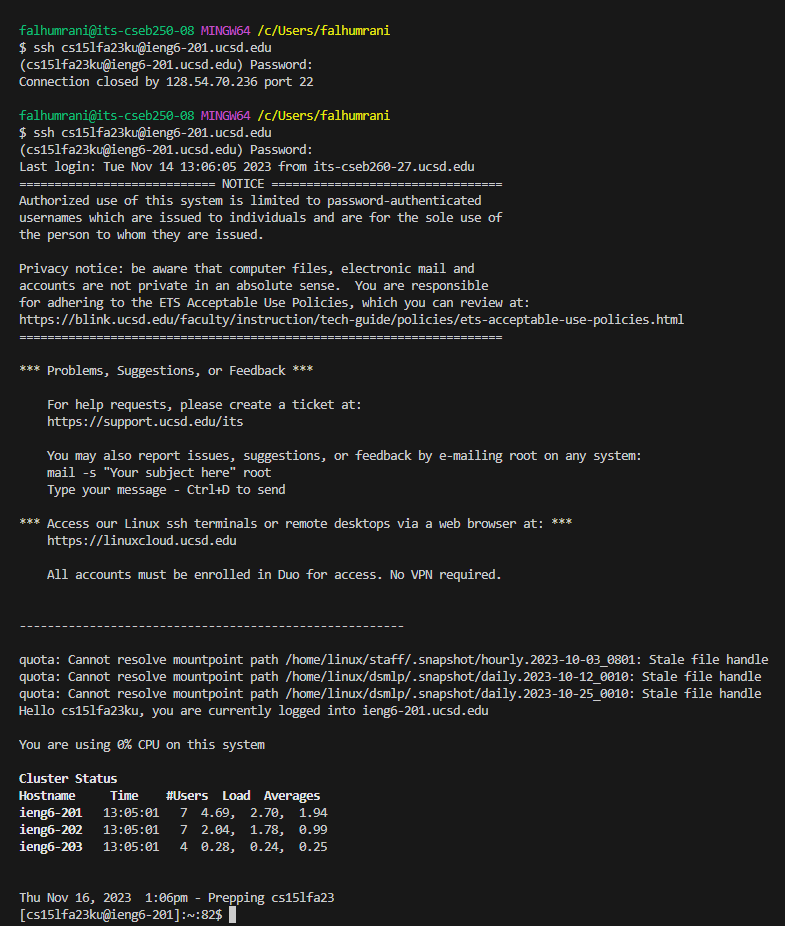
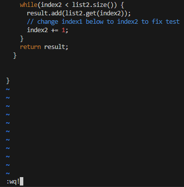

In this lab, we learned some command shortcuts and how to use vim. To showcase our new found understanding of vim, we'll use what we learned on ieng6 with a forked lab7 Repository.

Before starting, I must mention that these steps are done a new terminal, so there will be no search history and I won't be using the ieng6's history before this report.  

**Step 1.** Log into ieng6:    
---
*Keys pressed:* `ssh cs15lfa23ku@ieng6-201.ucsd.edu`. `<enter>`, then I type my password `<enter>`.  
    

**Step 2.** Clone your fork of the repository from your Github account (using the SSH URL):   
---
We first copy the ssh url from the forked repository by pressing the copy button:
  
Back to the terminal -->  

*Keys pressed:* write the command `git clone` and then press `<ctrl+v>`  to paste `git@github.com:Passing-by-github/lab7.git`, then `<enter>`:  
    

**Step 3.** Run the tests, demonstrating that they fail:   
---
*Keys pressed:* `ls` `<enter>` to see which direcory to enter and then `cd lab 7` `<enter>`.   
`ls` `<enter>` again to see what's inside of `lab 7` `<enter>`, we notice the `test.sh` bash script.  
`bash test.sh` `<enter>` and then we see the failed tests:  

**Step 4.** Edit the code file to fix the failing test:  
---
We notice that the failure happened in line 44 of ListExamples.java file. Now to access the file from a remote account, we use the command `vim`. The file content will show on the termianl and vim has many commands and mods that help modify the file. 
*Keys pressed:* `vim` `L` `<tab>`, which will autocomplete the line with the closest file name(ListExamples), and then I type `.java <enter>`:     
   

Now I'm in the nomal mod of `vim`, where I can write commands. So I type `:44` to jump to line 44, where the error was documented. The cursor wasn't on the right place, so I used `<l>` to move left and find the specific error: `<l> <l> <l> <l> <l> <l>` . Afterwards, I changed my mod to insert by using the `<i>` command and made my edits,`<i> <backspace> 2` I went back to normal mode using the `esc` button and `wq!` to save my new edits, `<escape> <:wq!> <enter>`:     

    

**Step 5.** Run the tests, demonstrating that they now succeed:  
---
*Keys pressed:*  `<up> <up>` to access the command  `bash test.sh` using the search history, `<enter>` and then we see the succeed tests: 
  

**Step 6.** Commit and push the resulting change to your Github account (you can pick any commit message!):    
---
*Keys pressed:*  
- `git add L <tab>.java <enter>`, the `git add` command ensures whatever changes that happened in the ListExamples.java file will be in the next commit.  
- `git commit <tab> -m "fixed typo" <enter>`, the `git commit` command saves the changes that were recorded using the `git add` command and `-m` will add a comment for the purpose of committing. 
- `git push <tab>`, the `git push` command uploads the commit into my Gihub account.    

